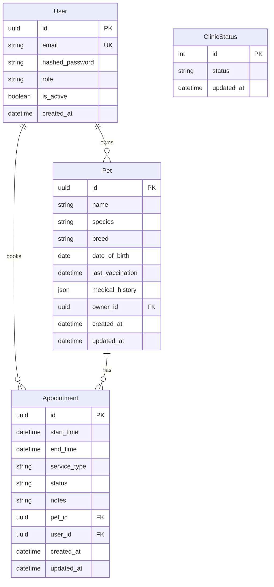

# Design Document: Vet Clinic Scheduling System Backend API

## Overview

This document describes the technical design for a REST API backend system for a veterinary clinic. The system enables pet owners to register pets and book appointments while allowing clinic administrators to manage all resources and clinic operational status.

### Technology Stack

- **Framework**: FastAPI (Python 3.12+)
- **Database**: NeonDB (PostgreSQL) via SQLModel (synchronous ORM)
- **Authentication**: JWT with python-jose and passlib[bcrypt]
- **Validation**: Pydantic (built into SQLModel)

### Architecture Pattern

The system follows a strict three-layer architecture:

```
┌─────────────────────────────────────┐
│   Router Layer (API Endpoints)      │  ← HTTP Request/Response
├─────────────────────────────────────┤
│   Service Layer (Business Logic)    │  ← Validation, Rules
├─────────────────────────────────────┤
│   Repository Layer (Data Access)    │  ← Database Queries
├─────────────────────────────────────┤
│   Database Layer (SQLModel ORM)     │  ← PostgreSQL/NeonDB
└─────────────────────────────────────┘
```

**Layer Responsibilities**:
- **Router**: Handle HTTP requests/responses, validate request schemas, call service methods
- **Service**: Implement business logic, enforce business rules, coordinate repositories
- **Repository**: Execute database queries (CRUD), abstract SQLModel operations

### Design Principles

- **DRY (Don't Repeat Yourself)**: Shared utilities for common operations
- **KISS (Keep It Simple)**: Clear, readable code without over-engineering
- **Type Safety**: Python type hints everywhere
- **Separation of Concerns**: Each layer has single responsibility
- **RESTful Design**: Clean, predictable API endpoints


## Architecture

### Project Structure

```
backend/
├── app/
│   ├── main.py                    # FastAPI app entry point
│   ├── core/                      # Core configuration
│   │   ├── config.py             # Environment config (enhance existing)
│   │   └── database.py           # Database setup (enhance existing)
│   ├── common/                    # Shared utilities
│   │   ├── enums.py              # String enums (UserRole, AppointmentStatus, etc.)
│   │   ├── exceptions.py         # Custom HTTP exceptions
│   │   ├── dependencies.py       # FastAPI dependencies (auth, RBAC)
│   │   └── utils.py              # Helper functions
│   ├── infrastructure/            # External services
│   │   └── auth.py               # JWT & password hashing
│   └── features/                  # Feature modules
│       ├── auth/                  # Authentication
│       │   ├── router.py
│       │   ├── schemas.py
│       │   └── service.py
│       ├── users/                 # User management
│       │   ├── models.py
│       │   ├── repository.py
│       │   └── service.py
│       ├── pets/                  # Pet management
│       │   ├── models.py
│       │   ├── schemas.py
│       │   ├── repository.py
│       │   ├── service.py
│       │   └── router.py
│       ├── appointments/          # Appointment booking
│       │   ├── models.py
│       │   ├── schemas.py
│       │   ├── repository.py
│       │   ├── service.py
│       │   └── router.py
│       └── clinic/                # Clinic status
│           ├── models.py
│           ├── schemas.py
│           ├── repository.py
│           ├── service.py
│           └── router.py
```

### Module Organization

**Core Modules**:
- `core/config.py`: Environment variables, settings (JWT_SECRET_KEY, DATABASE_URL, ADMIN_EMAIL)
- `core/database.py`: SQLModel engine, session management

**Common Modules**:
- `common/enums.py`: UserRole, AppointmentStatus, ServiceType, ClinicStatus
- `common/exceptions.py`: NotFoundException, ForbiddenException, BadRequestException, UnauthorizedException
- `common/dependencies.py`: get_current_user, require_role
- `common/utils.py`: calculate_end_time, get_vaccination_status

**Infrastructure**:
- `infrastructure/auth.py`: hash_password, verify_password, create_access_token, verify_token

**Feature Modules** (vertical slicing):
Each feature contains models, schemas, repository, service, and router following the three-layer pattern.

## Components and Interfaces

### Database Models (SQLModel)

#### User Model

```python
from sqlmodel import SQLModel, Field, Relationship
from datetime import datetime
from typing import Optional, List
import uuid

class User(SQLModel, table=True):
    __tablename__ = "users"
    
    id: uuid.UUID = Field(default_factory=uuid.uuid4, primary_key=True)
    email: str = Field(max_length=255, unique=True, index=True, nullable=False)
    hashed_password: str = Field(max_length=255, nullable=False)
    role: str = Field(max_length=20, nullable=False)  # "admin" or "pet_owner"
    is_active: bool = Field(default=True)
    created_at: datetime = Field(default_factory=datetime.utcnow)
    
    # Relationships
    pets: List["Pet"] = Relationship(back_populates="owner", cascade_delete=True)
```

#### Pet Model

```python
from sqlmodel import Column, JSON

class Pet(SQLModel, table=True):
    __tablename__ = "pets"
    
    id: uuid.UUID = Field(default_factory=uuid.uuid4, primary_key=True)
    name: str = Field(max_length=100, nullable=False)
    species: str = Field(max_length=50, nullable=False)
    breed: Optional[str] = Field(default=None, max_length=100)
    date_of_birth: Optional[date] = Field(default=None)
    last_vaccination: Optional[datetime] = Field(default=None)
    medical_history: dict = Field(default={}, sa_column=Column(JSON))
    
    # Foreign key
    owner_id: uuid.UUID = Field(foreign_key="users.id", index=True, ondelete="CASCADE")
    
    # Timestamps
    created_at: datetime = Field(default_factory=datetime.utcnow)
    updated_at: datetime = Field(default_factory=datetime.utcnow)
    
    # Relationships
    owner: "User" = Relationship(back_populates="pets")
    appointments: List["Appointment"] = Relationship(back_populates="pet", cascade_delete=True)
```

#### Appointment Model

```python
class Appointment(SQLModel, table=True):
    __tablename__ = "appointments"
    
    id: uuid.UUID = Field(default_factory=uuid.uuid4, primary_key=True)
    start_time: datetime = Field(index=True, nullable=False)
    end_time: datetime = Field(index=True, nullable=False)
    service_type: str = Field(max_length=20, nullable=False)  # vaccination, routine, surgery, emergency
    status: str = Field(max_length=20, default="pending")  # pending, confirmed, cancelled, completed
    notes: Optional[str] = Field(default=None)
    
    # Foreign keys
    pet_id: uuid.UUID = Field(foreign_key="pets.id", index=True, ondelete="CASCADE")
    user_id: uuid.UUID = Field(foreign_key="users.id", index=True, ondelete="CASCADE")
    
    # Timestamps
    created_at: datetime = Field(default_factory=datetime.utcnow)
    updated_at: datetime = Field(default_factory=datetime.utcnow)
    
    # Relationships
    pet: "Pet" = Relationship(back_populates="appointments")
    user: "User" = Relationship()
```

#### ClinicStatus Model

```python
class ClinicStatus(SQLModel, table=True):
    __tablename__ = "clinic_status"
    
    id: int = Field(default=1, primary_key=True)  # Single row table
    status: str = Field(max_length=20, default="open")  # open, close, closing_soon
    updated_at: datetime = Field(default_factory=datetime.utcnow)
```

### Request/Response Schemas

#### Authentication Schemas

```python
from pydantic import BaseModel, EmailStr

class RegisterRequest(BaseModel):
    email: EmailStr
    password: str

class LoginRequest(BaseModel):
    email: EmailStr
    password: str

class TokenResponse(BaseModel):
    access_token: str
    token_type: str = "bearer"
```

#### Pet Schemas

```python
class PetCreateRequest(BaseModel):
    name: str
    species: str
    breed: Optional[str] = None
    date_of_birth: Optional[date] = None
    last_vaccination: Optional[datetime] = None
    medical_history: dict = {}

class PetUpdateRequest(BaseModel):
    name: Optional[str] = None
    species: Optional[str] = None
    breed: Optional[str] = None
    date_of_birth: Optional[date] = None
    last_vaccination: Optional[datetime] = None
    medical_history: Optional[dict] = None

class PetResponse(BaseModel):
    id: uuid.UUID
    name: str
    species: str
    breed: Optional[str]
    date_of_birth: Optional[date]
    last_vaccination: Optional[datetime]
    vaccination_status: str  # Computed: valid, expired, unknown
    medical_history: dict
    owner_id: uuid.UUID
    created_at: datetime
    updated_at: datetime
    
    class Config:
        from_attributes = True
```

#### Appointment Schemas

```python
class AppointmentCreateRequest(BaseModel):
    pet_id: uuid.UUID
    start_time: datetime
    service_type: str  # vaccination, routine, surgery, emergency
    notes: Optional[str] = None

class AppointmentUpdateStatusRequest(BaseModel):
    status: str  # confirmed, completed, cancelled

class AppointmentResponse(BaseModel):
    id: uuid.UUID
    pet_id: uuid.UUID
    user_id: uuid.UUID
    start_time: datetime
    end_time: datetime
    service_type: str
    status: str
    notes: Optional[str]
    created_at: datetime
    updated_at: datetime
    
    class Config:
        from_attributes = True
```

#### Clinic Schemas

```python
class ClinicStatusResponse(BaseModel):
    status: str  # open, close, closing_soon
    updated_at: datetime
    
    class Config:
        from_attributes = True

class ClinicStatusUpdateRequest(BaseModel):
    status: str  # open, close, closing_soon
```

### Repository Layer

#### UserRepository

```python
class UserRepository:
    def __init__(self, session: Session):
        self.session = session
    
    def get_by_id(self, user_id: uuid.UUID) -> Optional[User]:
        """Get user by ID"""
        return self.session.get(User, user_id)
    
    def get_by_email(self, email: str) -> Optional[User]:
        """Get user by email"""
        statement = select(User).where(User.email == email)
        return self.session.exec(statement).first()
    
    def create(self, user: User) -> User:
        """Create new user"""
        self.session.add(user)
        self.session.flush()
        self.session.refresh(user)
        return user
```

#### PetRepository

```python
class PetRepository:
    def __init__(self, session: Session):
        self.session = session
    
    def get_by_id(self, pet_id: uuid.UUID) -> Optional[Pet]:
        """Get pet by ID"""
        return self.session.get(Pet, pet_id)
    
    def get_all_by_owner(self, owner_id: uuid.UUID) -> List[Pet]:
        """Get all pets owned by a user"""
        statement = select(Pet).where(Pet.owner_id == owner_id)
        return list(self.session.exec(statement).all())
    
    def get_all(self) -> List[Pet]:
        """Get all pets (admin only)"""
        statement = select(Pet)
        return list(self.session.exec(statement).all())
    
    def create(self, pet: Pet) -> Pet:
        """Create new pet"""
        self.session.add(pet)
        self.session.flush()
        self.session.refresh(pet)
        return pet
    
    def update(self, pet: Pet) -> Pet:
        """Update existing pet"""
        pet.updated_at = datetime.utcnow()
        self.session.add(pet)
        self.session.flush()
        self.session.refresh(pet)
        return pet
    
    def delete(self, pet: Pet) -> None:
        """Delete pet"""
        self.session.delete(pet)
        self.session.flush()
```

#### AppointmentRepository

```python
class AppointmentRepository:
    def __init__(self, session: Session):
        self.session = session
    
    def get_by_id(self, appointment_id: uuid.UUID) -> Optional[Appointment]:
        """Get appointment by ID"""
        return self.session.get(Appointment, appointment_id)
    
    def get_all(
        self,
        status: Optional[str] = None,
        from_date: Optional[datetime] = None,
        to_date: Optional[datetime] = None
    ) -> List[Appointment]:
        """Get all appointments with optional filters"""
        statement = select(Appointment)
        
        if status:
            statement = statement.where(Appointment.status == status)
        if from_date:
            statement = statement.where(Appointment.start_time >= from_date)
        if to_date:
            statement = statement.where(Appointment.start_time <= to_date)
        
        return list(self.session.exec(statement).all())
    
    def get_by_owner_id(
        self,
        owner_id: uuid.UUID,
        status: Optional[str] = None,
        from_date: Optional[datetime] = None,
        to_date: Optional[datetime] = None
    ) -> List[Appointment]:
        """Get appointments for pets owned by a user"""
        statement = select(Appointment).join(Pet).where(Pet.owner_id == owner_id)
        
        if status:
            statement = statement.where(Appointment.status == status)
        if from_date:
            statement = statement.where(Appointment.start_time >= from_date)
        if to_date:
            statement = statement.where(Appointment.start_time <= to_date)
        
        return list(self.session.exec(statement).all())
    
    def check_overlap(
        self,
        start_time: datetime,
        end_time: datetime,
        exclude_id: Optional[uuid.UUID] = None
    ) -> bool:
        """Check if time slot has overlapping pending/confirmed appointments"""
        statement = select(Appointment).where(
            and_(
                Appointment.status.in_(["pending", "confirmed"]),
                Appointment.start_time < end_time,
                Appointment.end_time > start_time
            )
        )
        
        if exclude_id:
            statement = statement.where(Appointment.id != exclude_id)
        
        result = self.session.exec(statement).first()
        return result is not None
    
    def create(self, appointment: Appointment) -> Appointment:
        """Create new appointment"""
        self.session.add(appointment)
        self.session.flush()
        self.session.refresh(appointment)
        return appointment
    
    def update(self, appointment: Appointment) -> Appointment:
        """Update existing appointment"""
        appointment.updated_at = datetime.utcnow()
        self.session.add(appointment)
        self.session.flush()
        self.session.refresh(appointment)
        return appointment
    
    def delete(self, appointment: Appointment) -> None:
        """Delete appointment"""
        self.session.delete(appointment)
        self.session.flush()
```

#### ClinicStatusRepository

```python
class ClinicStatusRepository:
    def __init__(self, session: Session):
        self.session = session
    
    def get_current_status(self) -> ClinicStatus:
        """Get current clinic status (single row)"""
        status = self.session.get(ClinicStatus, 1)
        if not status:
            # Initialize with default status
            status = ClinicStatus(id=1, status="open")
            self.session.add(status)
            self.session.flush()
            self.session.refresh(status)
        return status
    
    def update_status(self, new_status: str) -> ClinicStatus:
        """Update clinic status"""
        status = self.get_current_status()
        status.status = new_status
        status.updated_at = datetime.utcnow()
        self.session.add(status)
        self.session.flush()
        self.session.refresh(status)
        return status
```

### Service Layer

#### AuthService

```python
class AuthService:
    def __init__(self, user_repo: UserRepository):
        self.user_repo = user_repo
    
    def register(self, email: str, password: str, admin_email: str) -> User:
        """Register new user with role assignment"""
        # Check if email already exists
        existing_user = self.user_repo.get_by_email(email)
        if existing_user:
            raise BadRequestException("Email already registered")
        
        # Determine role based on email
        role = "admin" if email == admin_email else "pet_owner"
        
        # Hash password
        hashed_password = hash_password(password)
        
        # Create user
        user = User(
            email=email,
            hashed_password=hashed_password,
            role=role
        )
        
        return self.user_repo.create(user)
    
    def login(self, email: str, password: str) -> str:
        """Authenticate user and return JWT token"""
        # Get user by email
        user = self.user_repo.get_by_email(email)
        if not user:
            raise UnauthorizedException("Invalid credentials")
        
        # Verify password
        if not verify_password(password, user.hashed_password):
            raise UnauthorizedException("Invalid credentials")
        
        # Check if active
        if not user.is_active:
            raise ForbiddenException("Account is deactivated")
        
        # Create JWT token
        token_data = {"sub": str(user.id), "role": user.role}
        access_token = create_access_token(token_data)
        
        return access_token
```

#### PetService

```python
class PetService:
    def __init__(self, pet_repo: PetRepository):
        self.pet_repo = pet_repo
    
    def create_pet(
        self,
        name: str,
        species: str,
        current_user: User,
        breed: Optional[str] = None,
        date_of_birth: Optional[date] = None,
        last_vaccination: Optional[datetime] = None,
        medical_history: dict = {}
    ) -> Pet:
        """Create new pet owned by current user"""
        pet = Pet(
            name=name,
            species=species,
            breed=breed,
            date_of_birth=date_of_birth,
            last_vaccination=last_vaccination,
            medical_history=medical_history,
            owner_id=current_user.id
        )
        
        return self.pet_repo.create(pet)
    
    def get_pets(self, current_user: User) -> List[Pet]:
        """Get pets based on user role"""
        if current_user.role == "admin":
            return self.pet_repo.get_all()
        else:
            return self.pet_repo.get_all_by_owner(current_user.id)
    
    def get_pet_by_id(self, pet_id: uuid.UUID, current_user: User) -> Pet:
        """Get specific pet with ownership validation"""
        pet = self.pet_repo.get_by_id(pet_id)
        if not pet:
            raise NotFoundException("Pet")
        
        # Validate ownership for pet owners
        if current_user.role == "pet_owner" and pet.owner_id != current_user.id:
            raise ForbiddenException("You can only access your own pets")
        
        return pet
    
    def update_pet(
        self,
        pet_id: uuid.UUID,
        current_user: User,
        name: Optional[str] = None,
        species: Optional[str] = None,
        breed: Optional[str] = None,
        date_of_birth: Optional[date] = None,
        last_vaccination: Optional[datetime] = None,
        medical_history: Optional[dict] = None
    ) -> Pet:
        """Update pet with ownership validation"""
        pet = self.get_pet_by_id(pet_id, current_user)
        
        # Update fields if provided
        if name is not None:
            pet.name = name
        if species is not None:
            pet.species = species
        if breed is not None:
            pet.breed = breed
        if date_of_birth is not None:
            pet.date_of_birth = date_of_birth
        if last_vaccination is not None:
            pet.last_vaccination = last_vaccination
        if medical_history is not None:
            pet.medical_history = medical_history
        
        return self.pet_repo.update(pet)
    
    def delete_pet(self, pet_id: uuid.UUID, current_user: User) -> None:
        """Delete pet with ownership validation"""
        pet = self.get_pet_by_id(pet_id, current_user)
        self.pet_repo.delete(pet)
```

#### AppointmentService

```python
class AppointmentService:
    def __init__(
        self,
        appointment_repo: AppointmentRepository,
        pet_repo: PetRepository,
        clinic_status_repo: ClinicStatusRepository
    ):
        self.appointment_repo = appointment_repo
        self.pet_repo = pet_repo
        self.clinic_status_repo = clinic_status_repo
    
    def create_appointment(
        self,
        pet_id: uuid.UUID,
        start_time: datetime,
        service_type: str,
        current_user: User,
        notes: Optional[str] = None
    ) -> Appointment:
        """Create appointment with business rule validation"""
        
        # 1. Validate pet exists and ownership
        pet = self.pet_repo.get_by_id(pet_id)
        if not pet:
            raise NotFoundException("Pet")
        
        if current_user.role == "pet_owner" and pet.owner_id != current_user.id:
            raise ForbiddenException("You can only book for your own pets")
        
        # 2. Validate time is in future
        if start_time <= datetime.utcnow():
            raise BadRequestException("Start time must be in the future")
        
        # 3. Calculate end time
        end_time = calculate_end_time(start_time, service_type)
        
        # 4. Check clinic is open
        clinic_status = self.clinic_status_repo.get_current_status()
        if clinic_status.status == "close":
            raise BadRequestException("Clinic is closed")
        
        # 5. Check for overlaps
        if self.appointment_repo.check_overlap(start_time, end_time):
            raise BadRequestException("Time slot is occupied")
        
        # 6. Create appointment
        appointment = Appointment(
            pet_id=pet_id,
            user_id=current_user.id,
            start_time=start_time,
            end_time=end_time,
            service_type=service_type,
            notes=notes,
            status="pending"
        )
        
        return self.appointment_repo.create(appointment)
    
    def get_appointments(
        self,
        current_user: User,
        status: Optional[str] = None,
        from_date: Optional[datetime] = None,
        to_date: Optional[datetime] = None
    ) -> List[Appointment]:
        """Get appointments based on user role"""
        if current_user.role == "admin":
            return self.appointment_repo.get_all(status, from_date, to_date)
        else:
            return self.appointment_repo.get_by_owner_id(
                current_user.id, status, from_date, to_date
            )
    
    def update_appointment_status(
        self,
        appointment_id: uuid.UUID,
        new_status: str,
        current_user: User
    ) -> Appointment:
        """Update appointment status with validation"""
        appointment = self.appointment_repo.get_by_id(appointment_id)
        if not appointment:
            raise NotFoundException("Appointment")
        
        # Cannot change completed or cancelled appointments
        if appointment.status in ["completed", "cancelled"]:
            raise BadRequestException(
                f"Cannot change status of {appointment.status} appointment"
            )
        
        # Only admin can confirm or complete
        if new_status in ["confirmed", "completed"] and current_user.role != "admin":
            raise ForbiddenException("Only admin can confirm or complete appointments")
        
        # Pet owners can only cancel their own appointments
        if new_status == "cancelled":
            if current_user.role == "pet_owner":
                pet = self.pet_repo.get_by_id(appointment.pet_id)
                if pet.owner_id != current_user.id:
                    raise ForbiddenException("You can only cancel your own appointments")
        
        # Cannot cancel completed appointments
        if new_status == "cancelled" and appointment.status == "completed":
            raise BadRequestException("Cannot cancel completed appointment")
        
        appointment.status = new_status
        return self.appointment_repo.update(appointment)
    
    def cancel_appointment(
        self,
        appointment_id: uuid.UUID,
        current_user: User
    ) -> None:
        """Cancel appointment (delete)"""
        appointment = self.appointment_repo.get_by_id(appointment_id)
        if not appointment:
            raise NotFoundException("Appointment")
        
        # Validate ownership for pet owners
        if current_user.role == "pet_owner":
            pet = self.pet_repo.get_by_id(appointment.pet_id)
            if pet.owner_id != current_user.id:
                raise ForbiddenException("You can only cancel your own appointments")
        
        # Cannot cancel completed appointments
        if appointment.status == "completed":
            raise BadRequestException("Cannot cancel completed appointment")
        
        self.appointment_repo.delete(appointment)
```

#### ClinicService

```python
class ClinicService:
    def __init__(self, clinic_status_repo: ClinicStatusRepository):
        self.clinic_status_repo = clinic_status_repo
    
    def get_status(self) -> ClinicStatus:
        """Get current clinic status (public endpoint)"""
        return self.clinic_status_repo.get_current_status()
    
    def update_status(self, new_status: str) -> ClinicStatus:
        """Update clinic status (admin only)"""
        return self.clinic_status_repo.update_status(new_status)
```

### Router Layer

#### Authentication Router

```python
from fastapi import APIRouter, Depends, status
from sqlmodel import Session

router = APIRouter(prefix="/api/v1/auth", tags=["Authentication"])

@router.post("/register", response_model=TokenResponse, status_code=status.HTTP_201_CREATED)
def register(
    request: RegisterRequest,
    session: Session = Depends(get_session)
):
    """Register new user and return JWT token"""
    user_repo = UserRepository(session)
    auth_service = AuthService(user_repo)
    
    user = auth_service.register(
        email=request.email,
        password=request.password,
        admin_email=settings.ADMIN_EMAIL
    )
    
    # Auto-login after registration
    token = create_access_token({"sub": str(user.id), "role": user.role})
    
    session.commit()
    return TokenResponse(access_token=token)

@router.post("/login", response_model=TokenResponse)
def login(
    request: LoginRequest,
    session: Session = Depends(get_session)
):
    """Login and return JWT token"""
    user_repo = UserRepository(session)
    auth_service = AuthService(user_repo)
    
    token = auth_service.login(email=request.email, password=request.password)
    
    return TokenResponse(access_token=token)
```

#### Pet Router

```python
router = APIRouter(prefix="/api/v1/pets", tags=["Pets"])

@router.post("", response_model=PetResponse, status_code=status.HTTP_201_CREATED)
def create_pet(
    request: PetCreateRequest,
    current_user: User = Depends(get_current_user),
    session: Session = Depends(get_session)
):
    """Create new pet"""
    pet_repo = PetRepository(session)
    pet_service = PetService(pet_repo)
    
    pet = pet_service.create_pet(
        name=request.name,
        species=request.species,
        breed=request.breed,
        date_of_birth=request.date_of_birth,
        last_vaccination=request.last_vaccination,
        medical_history=request.medical_history,
        current_user=current_user
    )
    
    session.commit()
    
    # Add computed vaccination status
    response = PetResponse.from_orm(pet)
    response.vaccination_status = get_vaccination_status(pet.last_vaccination)
    return response

@router.get("", response_model=List[PetResponse])
def get_pets(
    current_user: User = Depends(get_current_user),
    session: Session = Depends(get_session)
):
    """Get all pets (filtered by role)"""
    pet_repo = PetRepository(session)
    pet_service = PetService(pet_repo)
    
    pets = pet_service.get_pets(current_user)
    
    return [
        PetResponse(
            **pet.dict(),
            vaccination_status=get_vaccination_status(pet.last_vaccination)
        )
        for pet in pets
    ]

@router.get("/{pet_id}", response_model=PetResponse)
def get_pet(
    pet_id: uuid.UUID,
    current_user: User = Depends(get_current_user),
    session: Session = Depends(get_session)
):
    """Get specific pet"""
    pet_repo = PetRepository(session)
    pet_service = PetService(pet_repo)
    
    pet = pet_service.get_pet_by_id(pet_id, current_user)
    
    response = PetResponse.from_orm(pet)
    response.vaccination_status = get_vaccination_status(pet.last_vaccination)
    return response

@router.patch("/{pet_id}", response_model=PetResponse)
def update_pet(
    pet_id: uuid.UUID,
    request: PetUpdateRequest,
    current_user: User = Depends(get_current_user),
    session: Session = Depends(get_session)
):
    """Update pet"""
    pet_repo = PetRepository(session)
    pet_service = PetService(pet_repo)
    
    pet = pet_service.update_pet(
        pet_id=pet_id,
        current_user=current_user,
        **request.dict(exclude_unset=True)
    )
    
    session.commit()
    
    response = PetResponse.from_orm(pet)
    response.vaccination_status = get_vaccination_status(pet.last_vaccination)
    return response

@router.delete("/{pet_id}", status_code=status.HTTP_204_NO_CONTENT)
def delete_pet(
    pet_id: uuid.UUID,
    current_user: User = Depends(get_current_user),
    session: Session = Depends(get_session)
):
    """Delete pet"""
    pet_repo = PetRepository(session)
    pet_service = PetService(pet_repo)
    
    pet_service.delete_pet(pet_id, current_user)
    
    session.commit()
```

#### Appointment Router

```python
router = APIRouter(prefix="/api/v1/appointments", tags=["Appointments"])

@router.post("", response_model=AppointmentResponse, status_code=status.HTTP_201_CREATED)
def create_appointment(
    request: AppointmentCreateRequest,
    current_user: User = Depends(get_current_user),
    session: Session = Depends(get_session)
):
    """Create new appointment"""
    appointment_repo = AppointmentRepository(session)
    pet_repo = PetRepository(session)
    clinic_status_repo = ClinicStatusRepository(session)
    
    appointment_service = AppointmentService(
        appointment_repo, pet_repo, clinic_status_repo
    )
    
    appointment = appointment_service.create_appointment(
        pet_id=request.pet_id,
        start_time=request.start_time,
        service_type=request.service_type,
        notes=request.notes,
        current_user=current_user
    )
    
    session.commit()
    return AppointmentResponse.from_orm(appointment)

@router.get("", response_model=List[AppointmentResponse])
def get_appointments(
    status: Optional[str] = Query(None),
    from_date: Optional[datetime] = Query(None),
    to_date: Optional[datetime] = Query(None),
    current_user: User = Depends(get_current_user),
    session: Session = Depends(get_session)
):
    """Get appointments with filters"""
    appointment_repo = AppointmentRepository(session)
    pet_repo = PetRepository(session)
    clinic_status_repo = ClinicStatusRepository(session)
    
    appointment_service = AppointmentService(
        appointment_repo, pet_repo, clinic_status_repo
    )
    
    appointments = appointment_service.get_appointments(
        current_user=current_user,
        status=status,
        from_date=from_date,
        to_date=to_date
    )
    
    return [AppointmentResponse.from_orm(apt) for apt in appointments]

@router.patch("/{appointment_id}/status", response_model=AppointmentResponse)
def update_appointment_status(
    appointment_id: uuid.UUID,
    request: AppointmentUpdateStatusRequest,
    current_user: User = Depends(get_current_user),
    session: Session = Depends(get_session)
):
    """Update appointment status"""
    appointment_repo = AppointmentRepository(session)
    pet_repo = PetRepository(session)
    clinic_status_repo = ClinicStatusRepository(session)
    
    appointment_service = AppointmentService(
        appointment_repo, pet_repo, clinic_status_repo
    )
    
    appointment = appointment_service.update_appointment_status(
        appointment_id=appointment_id,
        new_status=request.status,
        current_user=current_user
    )
    
    session.commit()
    return AppointmentResponse.from_orm(appointment)

@router.delete("/{appointment_id}", status_code=status.HTTP_204_NO_CONTENT)
def cancel_appointment(
    appointment_id: uuid.UUID,
    current_user: User = Depends(get_current_user),
    session: Session = Depends(get_session)
):
    """Cancel appointment"""
    appointment_repo = AppointmentRepository(session)
    pet_repo = PetRepository(session)
    clinic_status_repo = ClinicStatusRepository(session)
    
    appointment_service = AppointmentService(
        appointment_repo, pet_repo, clinic_status_repo
    )
    
    appointment_service.cancel_appointment(appointment_id, current_user)
    
    session.commit()
```

#### Clinic Router

```python
router = APIRouter(prefix="/api/v1/clinic", tags=["Clinic"])

@router.get("/status", response_model=ClinicStatusResponse)
def get_clinic_status(session: Session = Depends(get_session)):
    """Get clinic status (public endpoint, no auth required)"""
    clinic_status_repo = ClinicStatusRepository(session)
    clinic_service = ClinicService(clinic_status_repo)
    
    status = clinic_service.get_status()
    
    return ClinicStatusResponse.from_orm(status)

@router.patch("/status", response_model=ClinicStatusResponse)
def update_clinic_status(
    request: ClinicStatusUpdateRequest,
    current_user: User = Depends(require_role(["admin"])),
    session: Session = Depends(get_session)
):
    """Update clinic status (admin only)"""
    clinic_status_repo = ClinicStatusRepository(session)
    clinic_service = ClinicService(clinic_status_repo)
    
    status = clinic_service.update_status(request.status)
    
    session.commit()
    return ClinicStatusResponse.from_orm(status)
```

## Data Models

### Database Schema



### Enums

```python
# common/enums.py
from enum import Enum

class UserRole(str, Enum):
    ADMIN = "admin"
    PET_OWNER = "pet_owner"

class AppointmentStatus(str, Enum):
    PENDING = "pending"
    CONFIRMED = "confirmed"
    CANCELLED = "cancelled"
    COMPLETED = "completed"

class ServiceType(str, Enum):
    VACCINATION = "vaccination"
    ROUTINE = "routine"
    SURGERY = "surgery"
    EMERGENCY = "emergency"

class ClinicStatusEnum(str, Enum):
    OPEN = "open"
    CLOSE = "close"
    CLOSING_SOON = "closing_soon"

class VaccinationStatus(str, Enum):
    VALID = "valid"
    EXPIRED = "expired"
    UNKNOWN = "unknown"
```

### Service Duration Constants

```python
# common/utils.py
SERVICE_DURATIONS = {
    "vaccination": 30,
    "routine": 45,
    "surgery": 120,
    "emergency": 15
}

def calculate_end_time(start_time: datetime, service_type: str) -> datetime:
    """Calculate appointment end time based on service type"""
    duration_minutes = SERVICE_DURATIONS.get(service_type, 30)
    return start_time + timedelta(minutes=duration_minutes)

def get_vaccination_status(last_vaccination: Optional[datetime]) -> str:
    """Compute vaccination status based on last vaccination date"""
    if not last_vaccination:
        return VaccinationStatus.UNKNOWN
    
    one_year_ago = datetime.utcnow() - timedelta(days=365)
    return VaccinationStatus.EXPIRED if last_vaccination < one_year_ago else VaccinationStatus.VALID
```

### Authentication Infrastructure

```python
# infrastructure/auth.py
from datetime import datetime, timedelta
from jose import JWTError, jwt
from passlib.context import CryptContext

pwd_context = CryptContext(schemes=["bcrypt"], deprecated="auto")

def hash_password(password: str) -> str:
    """Hash a plaintext password"""
    return pwd_context.hash(password)

def verify_password(plain_password: str, hashed_password: str) -> bool:
    """Verify password against hash"""
    return pwd_context.verify(plain_password, hashed_password)

def create_access_token(data: dict) -> str:
    """Create JWT access token"""
    to_encode = data.copy()
    expire = datetime.utcnow() + timedelta(minutes=settings.JWT_EXPIRE_MINUTES)
    to_encode.update({"exp": expire})
    
    return jwt.encode(
        to_encode,
        settings.JWT_SECRET_KEY,
        algorithm=settings.JWT_ALGORITHM
    )

def verify_token(token: str) -> dict:
    """Verify and decode JWT token"""
    try:
        payload = jwt.decode(
            token,
            settings.JWT_SECRET_KEY,
            algorithms=[settings.JWT_ALGORITHM]
        )
        return payload
    except JWTError:
        raise UnauthorizedException("Could not validate credentials")
```

### Dependencies

```python
# common/dependencies.py
from fastapi import Depends, HTTPException
from fastapi.security import HTTPBearer, HTTPAuthorizationCredentials
from sqlmodel import Session
from typing import List

security = HTTPBearer()

def get_current_user(
    credentials: HTTPAuthorizationCredentials = Depends(security),
    session: Session = Depends(get_session)
) -> User:
    """Get authenticated user from JWT token"""
    token = credentials.credentials
    payload = verify_token(token)
    user_id = payload.get("sub")
    
    if not user_id:
        raise UnauthorizedException("Invalid token")
    
    user_repo = UserRepository(session)
    user = user_repo.get_by_id(uuid.UUID(user_id))
    
    if not user:
        raise NotFoundException("User")
    
    if not user.is_active:
        raise ForbiddenException("Account is deactivated")
    
    return user

def require_role(allowed_roles: List[str]):
    """Dependency factory for role-based access control"""
    def role_checker(current_user: User = Depends(get_current_user)) -> User:
        if current_user.role not in allowed_roles:
            raise ForbiddenException(
                f"Required roles: {', '.join(allowed_roles)}"
            )
        return current_user
    return role_checker
```

### Custom Exceptions

```python
# common/exceptions.py
from fastapi import HTTPException, status

class NotFoundException(HTTPException):
    def __init__(self, resource: str):
        super().__init__(
            status_code=status.HTTP_404_NOT_FOUND,
            detail=f"{resource} not found"
        )

class ForbiddenException(HTTPException):
    def __init__(self, message: str = "Access denied"):
        super().__init__(
            status_code=status.HTTP_403_FORBIDDEN,
            detail=message
        )

class BadRequestException(HTTPException):
    def __init__(self, message: str):
        super().__init__(
            status_code=status.HTTP_400_BAD_REQUEST,
            detail=message
        )

class UnauthorizedException(HTTPException):
    def __init__(self, message: str = "Unauthorized"):
        super().__init__(
            status_code=status.HTTP_401_UNAUTHORIZED,
            detail=message,
            headers={"WWW-Authenticate": "Bearer"}
        )
```

## Correctness Properties

*A property is a characteristic or behavior that should hold true across all valid executions of a system—essentially, a formal statement about what the system should do. Properties serve as the bridge between human-readable specifications and machine-verifiable correctness guarantees.*

### Authentication and User Management Properties

**Property 1: Password hashing**
*For any* valid password, when a user registers, the stored password should be hashed and not equal to the plaintext password
**Validates: Requirements 1.1, 1.7**

**Property 2: Role assignment for non-admin emails**
*For any* email that does not match ADMIN_EMAIL, when a user registers, the assigned role should be "pet_owner"
**Validates: Requirements 1.3**

**Property 3: Duplicate email rejection**
*For any* email, if a user with that email already exists, attempting to register with the same email should be rejected with an error
**Validates: Requirements 1.4**

**Property 4: Valid login returns token**
*For any* registered user, when logging in with correct credentials, the system should return a valid JWT token
**Validates: Requirements 1.5**

**Property 5: Invalid credentials rejection**
*For any* login attempt with incorrect password or non-existent email, the system should reject the login and return an error
**Validates: Requirements 1.6**

**Property 6: Email format validation**
*For any* string that is not a valid email format, attempting to register should be rejected with a validation error
**Validates: Requirements 1.8**

**Property 7: JWT token round-trip**
*For any* valid user, creating a JWT token and then decoding it should return the same user ID and role
**Validates: Requirements 2.5**

**Property 8: Invalid token rejection**
*For any* malformed or expired JWT token, attempting to authenticate should be rejected with an authentication error
**Validates: Requirements 2.6**

### Pet Management Properties

**Property 9: Pet ownership association**
*For any* pet owner, when creating a pet, the pet's owner_id should be set to the authenticated user's ID
**Validates: Requirements 3.1**

**Property 10: Pet owner access control**
*For any* pet owner, when listing or accessing pets, only pets owned by that user should be returned or accessible
**Validates: Requirements 2.2, 3.2**

**Property 11: Pet data persistence**
*For any* pet with valid data (name, species, breed, date_of_birth, last_vaccination, medical_history), creating the pet and then retrieving it should return all the same field values
**Validates: Requirements 3.8**

**Property 12: Medical history JSON storage**
*For any* pet, the medical_history field should accept and return dictionary/JSON data structures
**Validates: Requirements 3.9**

**Property 13: Pet update authorization**
*For any* pet owner, attempting to update a pet not owned by that user should be rejected with an authorization error
**Validates: Requirements 3.5**

**Property 14: Pet deletion authorization**
*For any* pet owner, attempting to delete a pet not owned by that user should be rejected with an authorization error
**Validates: Requirements 3.6**

**Property 15: Vaccination status includes in response**
*For any* pet, when retrieved, the response should include a computed vaccination_status field
**Validates: Requirements 3.4, 4.4**

### Vaccination Status Computation Properties

**Property 16: Expired vaccination detection**
*For any* pet with last_vaccination more than 365 days in the past, the computed vaccination_status should be "expired"
**Validates: Requirements 4.2**

**Property 17: Valid vaccination detection**
*For any* pet with last_vaccination 365 days or less in the past, the computed vaccination_status should be "valid"
**Validates: Requirements 4.3**

### Appointment Creation and Validation Properties

**Property 18: Non-existent pet rejection**
*For any* non-existent pet ID, attempting to create an appointment should be rejected with a not found error
**Validates: Requirements 5.1**

**Property 19: Appointment pet ownership validation**
*For any* pet owner, attempting to create an appointment for a pet not owned by that user should be rejected with an authorization error
**Validates: Requirements 5.2**

**Property 20: Past time rejection**
*For any* start time in the past, attempting to create an appointment should be rejected with a validation error
**Validates: Requirements 5.4**

**Property 21: End time calculation**
*For any* appointment with a valid service_type, the end_time should be calculated as start_time plus the service duration (vaccination=30min, routine=45min, surgery=120min, emergency=15min)
**Validates: Requirements 5.5, 5.6, 5.7, 5.8, 5.9**

**Property 22: Closed clinic rejection**
*For any* appointment creation attempt when clinic status is "close", the appointment should be rejected with an error
**Validates: Requirements 5.10, 8.5**

**Property 23: Overlap detection**
*For any* two appointments where one starts before the other ends AND ends after the other starts, if both have status "pending" or "confirmed", they should be identified as overlapping and the second should be rejected
**Validates: Requirements 5.11, 9.1, 9.3, 9.4**

**Property 24: Successful appointment creation**
*For any* valid appointment (future time, no overlaps, clinic open, authorized pet), the created appointment should have status "pending"
**Validates: Requirements 5.12**

### Appointment Status Management Properties

**Property 25: Pet owner cannot confirm or complete**
*For any* pet owner, attempting to update an appointment status to "confirmed" or "completed" should be rejected with an authorization error
**Validates: Requirements 6.3, 6.4**

**Property 26: Completed appointment immutability**
*For any* appointment with status "completed", attempting to update its status should be rejected with an error
**Validates: Requirements 6.5, 6.10**

**Property 27: Cancelled appointment immutability**
*For any* appointment with status "cancelled", attempting to update its status should be rejected with an error
**Validates: Requirements 6.6**

**Property 28: Pet owner cancellation authorization**
*For any* pet owner, when cancelling an appointment, the system should verify the appointment's pet is owned by that user, and reject if not
**Validates: Requirements 6.7, 6.8**

### Appointment Filtering Properties

**Property 29: Pet owner appointment filtering**
*For any* pet owner, when listing appointments, only appointments for pets owned by that user should be returned
**Validates: Requirements 7.1**

**Property 30: Status filter**
*For any* status value, when filtering appointments by that status, all returned appointments should have that status
**Validates: Requirements 7.3**

**Property 31: Date range filter**
*For any* from_date and to_date, when filtering appointments, all returned appointments should have start_time >= from_date and start_time <= to_date
**Validates: Requirements 7.4, 7.5**

**Property 32: Multiple filter combination**
*For any* combination of filters (status, from_date, to_date), all returned appointments should match all specified filter criteria
**Validates: Requirements 7.6**

### Clinic Status Properties

**Property 33: Pet owner cannot update clinic status**
*For any* pet owner, attempting to update clinic status should be rejected with an authorization error
**Validates: Requirements 8.3**

**Property 34: Clinic status enum validation**
*For any* status value not in ["open", "close", "closing_soon"], attempting to update clinic status should be rejected with a validation error
**Validates: Requirements 8.4**

## Error Handling

### Exception Hierarchy

The system uses custom HTTP exceptions for consistent error responses:

```python
# common/exceptions.py

class NotFoundException(HTTPException):
    """Raised when a requested resource doesn't exist"""
    status_code: 404
    
class ForbiddenException(HTTPException):
    """Raised when user lacks permission for an action"""
    status_code: 403
    
class BadRequestException(HTTPException):
    """Raised when request data is invalid"""
    status_code: 400
    
class UnauthorizedException(HTTPException):
    """Raised when authentication fails"""
    status_code: 401
```

### Error Response Format

All errors return consistent JSON structure:

```json
{
  "detail": "Descriptive error message"
}
```

### Error Scenarios

**Authentication Errors (401)**:
- Invalid JWT token
- Expired JWT token
- Missing JWT token on protected endpoint
- Invalid login credentials
- Malformed token

**Authorization Errors (403)**:
- Pet owner accessing another user's pet
- Pet owner accessing admin-only endpoint
- Pet owner confirming/completing appointments
- Pet owner updating clinic status
- Inactive user account

**Not Found Errors (404)**:
- Pet ID doesn't exist
- Appointment ID doesn't exist
- User ID doesn't exist

**Validation Errors (400)**:
- Duplicate email registration
- Invalid email format
- Appointment start time in past
- Overlapping appointment time slot
- Clinic closed for appointment booking
- Invalid service type
- Invalid appointment status
- Invalid clinic status
- Attempting to modify completed/cancelled appointment
- Attempting to cancel completed appointment

**Server Errors (500)**:
- Database connection failures
- Unexpected exceptions
- All 500 errors logged for debugging

### Error Handling Strategy

1. **Service Layer**: Business logic validation throws custom exceptions
2. **Repository Layer**: Database errors propagate up
3. **Router Layer**: FastAPI automatically converts exceptions to HTTP responses
4. **Validation**: Pydantic handles request schema validation automatically
5. **Logging**: All 500 errors logged with full stack trace

## Testing Strategy

### Dual Testing Approach

The system requires both unit tests and property-based tests for comprehensive coverage:

- **Unit Tests**: Verify specific examples, edge cases, and error conditions
- **Property Tests**: Verify universal properties across all inputs
- Both are complementary and necessary

### Property-Based Testing

**Library**: `hypothesis` for Python

**Configuration**:
- Minimum 100 iterations per property test
- Each test tagged with feature name and property number
- Tag format: `# Feature: vet-clinic-backend, Property N: [property description]`

**Property Test Coverage**:
Each of the 34 correctness properties listed above must be implemented as a property-based test. Property tests should:
- Generate random valid inputs using Hypothesis strategies
- Execute the system behavior
- Assert the property holds for all generated inputs
- Handle edge cases through generator configuration

**Example Property Test Structure**:

```python
from hypothesis import given, strategies as st
import pytest

# Feature: vet-clinic-backend, Property 1: Password hashing
@given(
    email=st.emails(),
    password=st.text(min_size=8, max_size=100)
)
def test_password_hashing_property(email, password):
    """For any valid password, stored password should be hashed"""
    user = register_user(email, password)
    assert user.hashed_password != password
    assert verify_password(password, user.hashed_password)
```

### Unit Testing

**Library**: `pytest`

**Unit Test Focus**:
- Specific examples demonstrating correct behavior
- Edge cases (null values, boundary conditions, empty collections)
- Error conditions and exception handling
- Integration between layers
- Admin-specific behaviors (examples, not properties)

**Unit Test Balance**:
- Avoid writing too many unit tests for scenarios covered by properties
- Focus on concrete examples that illustrate requirements
- Test integration points between components
- Verify error messages and status codes

**Example Unit Test Structure**:

```python
def test_admin_email_gets_admin_role():
    """Admin email should be assigned admin role"""
    user = register_user(ADMIN_EMAIL, "password123")
    assert user.role == "admin"

def test_pet_owner_can_list_only_own_pets():
    """Pet owner should only see their own pets"""
    owner1 = create_user("owner1@test.com")
    owner2 = create_user("owner2@test.com")
    pet1 = create_pet(owner1, "Fluffy")
    pet2 = create_pet(owner2, "Spot")
    
    pets = list_pets(owner1)
    assert len(pets) == 1
    assert pets[0].id == pet1.id

def test_null_vaccination_returns_unknown_status():
    """Pet with no vaccination date should have unknown status"""
    pet = create_pet(owner, "Rex", last_vaccination=None)
    response = get_pet(pet.id)
    assert response.vaccination_status == "unknown"
```

### Test Organization

```
tests/
├── unit/
│   ├── test_auth_service.py
│   ├── test_pet_service.py
│   ├── test_appointment_service.py
│   ├── test_clinic_service.py
│   └── test_utils.py
├── property/
│   ├── test_auth_properties.py
│   ├── test_pet_properties.py
│   ├── test_appointment_properties.py
│   └── test_clinic_properties.py
└── integration/
    ├── test_auth_endpoints.py
    ├── test_pet_endpoints.py
    ├── test_appointment_endpoints.py
    └── test_clinic_endpoints.py
```

### Test Data Generation

**Hypothesis Strategies**:
- `st.emails()` for email addresses
- `st.text()` for names, notes, species, breed
- `st.datetimes()` for timestamps
- `st.sampled_from()` for enums (service types, statuses)
- `st.dictionaries()` for medical history JSON
- `st.uuids()` for IDs
- Custom strategies for domain objects (User, Pet, Appointment)

### Integration Testing

Integration tests verify end-to-end flows through all layers:
- Test actual HTTP endpoints using FastAPI TestClient
- Use real database (test database or in-memory SQLite)
- Verify request/response schemas
- Test authentication and authorization flows
- Verify database transactions and rollbacks

### Test Coverage Goals

- **Line Coverage**: Minimum 80%
- **Branch Coverage**: Minimum 75%
- **Property Coverage**: 100% (all 34 properties implemented)
- **Critical Path Coverage**: 100% (auth, booking, validation)

### Continuous Integration

- Run all tests on every commit
- Property tests run with 100 iterations in CI
- Integration tests run against test database
- Coverage reports generated and tracked
- Fail build if coverage drops below threshold
